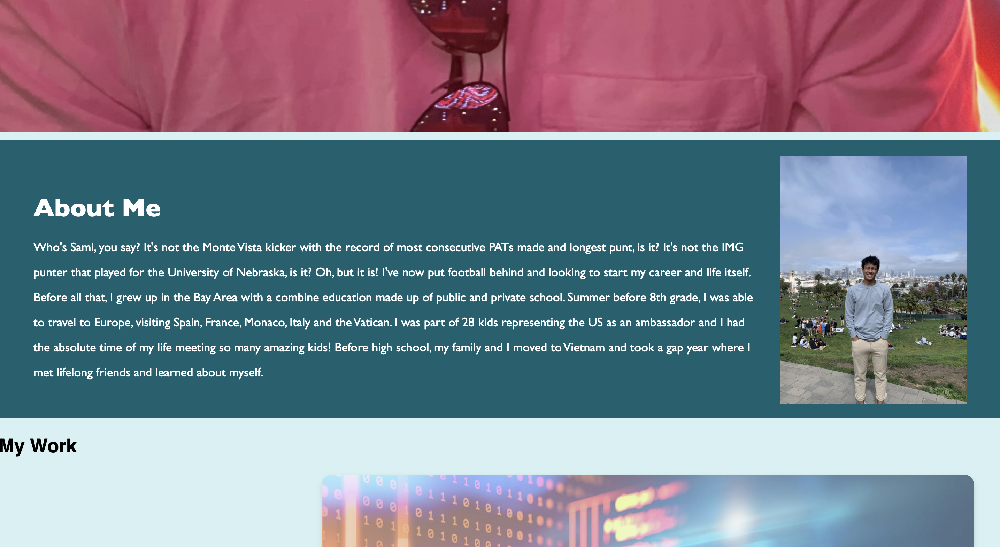

# sami_portfolio

<!-- TABLE OF CONTENTS -->

  
Table of Contents

    <ol>
        <li><a href="#about-the-project">About The Project</a></li>
        <li><a href="#license">License</a></li>
        <li><a href="#contact">Contact</a></li>
        <li><a href="#acknowledgements">Acknowledgements</a></li>
    </ol>

<!-- ABOUT THE PROJECT -->
## About The Project

The purpose of this project was to make a professional webpage displaying our portfolio. We had to use both HTML and CSS to construct and design the page but not yet Javascript. My portfolio contains an about me section, links to my projects and way to contact me for future employers. It is important that this site in maintained as this is a source of my resume for my professional life.

Creating this site really tested my knowledge and my resource skills, but per usual, it was a blast!

<!-- LICENSE -->
## License

Distributed under the MIT License. See `LICENSE` for more information.

<!-- CONTACT -->
## Contact

Sami Khawja - Skhawja11@gmail.com

Project Link: [GitHub](https://github.com/samikhawja/sami_portfolio)

Live Link: [Sami's Portfolio](https://samikhawja.github.io/sami_portfolio/)

<!-- ACKNOWLEDGEMENTS -->
## Acknowledgements
* Taylor Hackbart
* W3Schools
* StackOverflow
* Mozilla